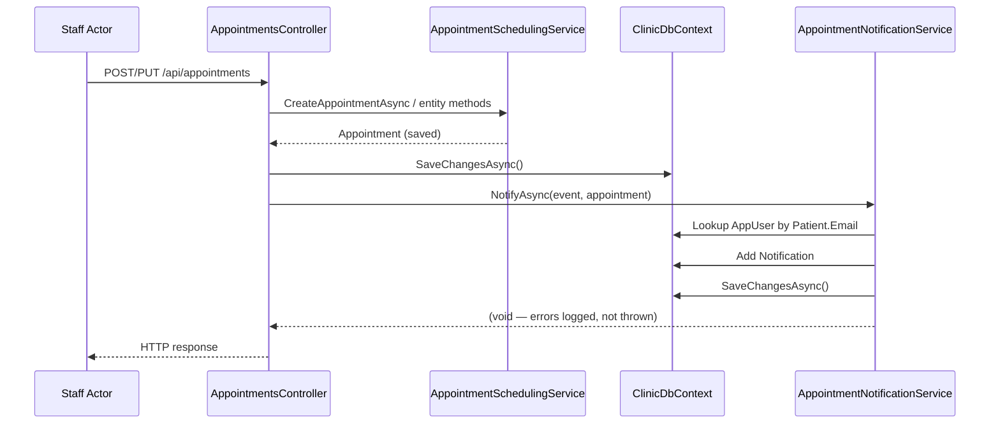

# Design Document: Appointment Notifications

## Overview

This feature extends the existing notification infrastructure to inform patients in real time when staff create, reschedule, cancel, or update their appointments. Today the only automated notification is the 24-hour reminder produced by `AppointmentReminderService`. After this feature ships, every staff-initiated appointment action will immediately generate an in-app notification with contextual action buttons, and every user role will have a "Notifications" link in the sidebar.

### Key Design Decisions

| Decision | Choice | Rationale |
|---|---|---|
| Service location | `ClinicScheduler.Web/Services/` | Follows the `AppointmentReminderService` pattern; needs `ClinicDbContext` and Identity `Users` table, both registered in the Web project. Core project has no EF dependency. |
| Integration point | `AppointmentsController` calls the notification service after each successful operation | Keeps notification logic decoupled from domain entities. The controller already orchestrates persistence and can catch notification failures without rolling back the appointment. |
| Service lifetime | Scoped | Matches `AppointmentSchedulingService` and `MissedAppointmentService` registrations. Scoped aligns with the per-request `ClinicDbContext`. |
| New enum values | `AppointmentCreated`, `AppointmentUpdated` added to `NotificationType` | Existing `AppointmentRescheduled` and `CancellationApproved` already cover reschedule and cancel events. Only creation and detail-update are missing. |
| Nav link placement | All roles get a "Notifications" link in `MainLayout.razor` | The `/notifications` page already uses `[Authorize]` with no role restriction. Every role benefits from seeing notifications. |
| Unread badge | Yes — query unread count and show a MudBadge on the nav link | Low-cost query; high-value UX signal for patients. |

## Architecture

The notification flow follows a synchronous, fire-and-forget-on-error pattern:



### Error Isolation

If `AppointmentNotificationService` fails (e.g., database error during notification persistence), it catches the exception, logs it, and returns. The appointment operation has already been committed in a prior `SaveChangesAsync` call, so the patient simply won't receive that particular notification. This matches the non-critical nature of in-app notifications.

## Components and Interfaces

### 1. `AppointmentNotificationService` (new)

**Location:** `ClinicScheduler.Web/Services/AppointmentNotificationService.cs`

```csharp
public sealed class AppointmentNotificationService
{
    private readonly ClinicDbContext _db;
    private readonly ILogger<AppointmentNotificationService> _logger;

    public AppointmentNotificationService(
        ClinicDbContext db,
        ILogger<AppointmentNotificationService> logger);

    /// Creates an AppointmentCreated notification for the patient.
    public Task NotifyAppointmentCreatedAsync(
        Appointment appointment, CancellationToken ct = default);

    /// Creates an AppointmentRescheduled notification with old and new times.
    public Task NotifyAppointmentRescheduledAsync(
        Appointment appointment,
        DateTime originalStartTime,
        DateTime originalEndTime,
        CancellationToken ct = default);

    /// Creates a CancellationApproved notification for the patient.
    public Task NotifyAppointmentCancelledAsync(
        Appointment appointment, CancellationToken ct = default);

    /// Creates an AppointmentUpdated notification describing what changed.
    public Task NotifyAppointmentUpdatedAsync(
        Appointment appointment,
        string changeDescription,
        CancellationToken ct = default);
}
```

Each method follows the same internal pattern:
1. Load the `Appointment` with `Patient` and `Therapist` includes (if not already loaded).
2. Query `_db.Users.FirstOrDefaultAsync(u => u.UserName == appointment.Patient.Email)`.
3. If no user found, return silently.
4. Build a `Notification` with the correct `NotificationType`, title, message, and `RelatedAppointmentId`.
5. `_db.Notifications.Add(notification)` then `_db.SaveChangesAsync()`.
6. Wrap the entire body in try/catch — log errors, never throw.

### 2. `NotificationType` enum (modified)

**Location:** `ClinicScheduler.Core/Entities/Notification.cs`

Two new values appended to the end of the enum to preserve existing ordinal values:

```csharp
public enum NotificationType
{
    MissedAppointment,        // 0
    UpcomingAppointment,      // 1
    RequestApproved,          // 2
    RequestDenied,            // 3
    SchedulingConflict,       // 4
    AppointmentRescheduled,   // 5
    CancellationRequested,    // 6
    CancellationApproved,     // 7
    CancellationDenied,       // 8
    AppointmentCreated,       // 9  ← NEW
    AppointmentUpdated        // 10 ← NEW
}
```

### 3. `AppointmentsController` (modified)

**Location:** `ClinicScheduler.Web/Api/AppointmentsController.cs`

Changes:
- Inject `AppointmentNotificationService` via constructor.
- **Create action:** After successful `SaveChangesAsync`, call `NotifyAppointmentCreatedAsync`.
- **Update action:** Detect what changed:
  - If `StartTime` changed → call `NotifyAppointmentRescheduledAsync` with old/new times.
  - If `Status` changed to `Canceled` → call `NotifyAppointmentCancelledAsync`.
  - If therapist, room, or other details changed without time change → build a change description string and call `NotifyAppointmentUpdatedAsync`.
- **MarkMissed action:** The existing `MissedAppointment` notification type already covers this; no change needed.

### 4. `Notifications.razor` (modified)

**Location:** `ClinicScheduler.Shared/Pages/Notifications.razor`

Changes:
- Add `TypeIcon` and `TypeColor` mappings for `AppointmentCreated` and `AppointmentUpdated`.
- Replace the generic "View Schedule" link with type-specific action buttons:

| NotificationType | Action Button Text | Navigation Target |
|---|---|---|
| `AppointmentCreated` | "View Appointment" | `/schedule` (or patient calendar) |
| `AppointmentRescheduled` | "View Appointment" | `/schedule` |
| `AppointmentUpdated` | "View Appointment" | `/schedule` |
| `CancellationApproved` | "Request New Appointment" | `/appointment-request` |
| All others with `RelatedAppointmentId` | "View Schedule" | `/schedule` (existing behavior) |

### 5. `MainLayout.razor` (modified)

**Location:** `ClinicScheduler.Shared/Pages/MainLayout.razor`

Changes:
- Add a "Notifications" `NavLink` inside each role's `AuthorizeView` block (Patient, Therapist, Staff).
- Query unread notification count on layout initialization and display a badge.

```razor
@* Inside each role's Authorized block, add: *@
<NavLink href="/notifications" class="nav-item">
    Notifications
    @if (_unreadCount > 0)
    {
        <span class="badge">@_unreadCount</span>
    }
</NavLink>
```

The unread count is fetched once on layout load by querying:
```csharp
_unreadCount = await DbContext.Notifications
    .CountAsync(n => n.UserId == _userId && !n.IsRead);
```

A CSS badge class provides a small colored indicator (e.g., a red circle with white text).

## Data Models

### Notification Entity (existing — no schema changes)

The existing `Notification` entity already has all required fields:

| Field | Type | Description |
|---|---|---|
| `Id` | `int` | Primary key |
| `UserId` | `string` | FK to `AspNetUsers.Id` |
| `Type` | `NotificationType` | Enum — extended with 2 new values |
| `Title` | `string` | Short notification title |
| `Message` | `string` | Detailed notification message |
| `IsRead` | `bool` | Defaults to `false` |
| `CreatedAt` | `DateTime` | Set to `DateTime.UtcNow` on creation |
| `RelatedAppointmentId` | `int?` | FK to `Appointments.Id` |

No new entities or migrations are needed. The `NotificationType` enum is stored as an integer by EF Core, and appending new values at the end preserves backward compatibility.

### Notification Message Templates

| Event | Title | Message Pattern |
|---|---|---|
| Created | "New Appointment Scheduled" | "An appointment has been scheduled with {TherapistName} on {Date} at {Time}." |
| Rescheduled | "Appointment Rescheduled" | "Your appointment has been rescheduled from {OldDate} at {OldTime} to {NewDate} at {NewTime}." |
| Cancelled | "Appointment Cancelled" | "Your appointment with {TherapistName} on {Date} at {Time} has been cancelled." |
| Updated | "Appointment Updated" | "Your appointment has been updated: {ChangeDescription}." |

## Correctness Properties

*A property is a characteristic or behavior that should hold true across all valid executions of a system — essentially, a formal statement about what the system should do. Properties serve as the bridge between human-readable specifications and machine-verifiable correctness guarantees.*

### Property 1: Creation notification produces correct type and message content

*For any* valid appointment with a resolvable patient AppUser, calling `NotifyAppointmentCreatedAsync` SHALL produce exactly one Notification of type `AppointmentCreated` whose message contains the therapist's full name, the appointment date, and the appointment time.

**Validates: Requirements 1.1, 1.3**

### Property 2: Reschedule notification includes both old and new times

*For any* valid appointment reschedule where the patient has a resolvable AppUser, calling `NotifyAppointmentRescheduledAsync` with the original and new start times SHALL produce exactly one Notification of type `AppointmentRescheduled` whose message contains both the original date/time and the new date/time.

**Validates: Requirements 2.1, 2.2**

### Property 3: Cancellation notification produces correct type and message content

*For any* valid appointment cancellation where the patient has a resolvable AppUser, calling `NotifyAppointmentCancelledAsync` SHALL produce exactly one Notification of type `CancellationApproved` whose message contains the therapist's full name and the original appointment date and time.

**Validates: Requirements 3.1, 3.2**

### Property 4: Update notification describes the change

*For any* valid appointment detail update where the patient has a resolvable AppUser, calling `NotifyAppointmentUpdatedAsync` with a change description SHALL produce exactly one Notification of type `AppointmentUpdated` whose message contains the provided change description.

**Validates: Requirements 4.1, 4.2**

### Property 5: RelatedAppointmentId invariant

*For any* appointment notification event (created, rescheduled, cancelled, or updated) where a notification is produced, the notification's `RelatedAppointmentId` SHALL equal the source appointment's `Id`.

**Validates: Requirements 1.4, 2.3, 3.3, 4.3**

### Property 6: No-user graceful skip

*For any* appointment notification event where the patient's email does not match any AppUser's UserName, the service SHALL produce zero notifications and SHALL NOT throw an exception.

**Validates: Requirements 1.5, 2.4, 3.4, 4.4**

## Error Handling

| Scenario | Behavior |
|---|---|
| Patient has no AppUser account | Service returns silently; no notification created. Appointment operation unaffected. |
| Database error during notification persistence | Service catches the exception, logs it via `ILogger`, and returns. The appointment operation has already been committed. |
| Appointment entity missing Patient/Therapist navigation properties | Service loads them via `Include` before building the message. If the patient or therapist record is missing (data integrity issue), the service logs a warning and returns. |
| Null or empty change description for update notifications | Service uses a fallback message: "Your appointment details have been updated." |

## Testing Strategy

### Property-Based Tests (FsCheck + xunit)

The project already has FsCheck 3.3.2 and xunit configured in `ClinicScheduler.Core.Tests`. Property tests will use an in-memory `ClinicDbContext` (via `Microsoft.EntityFrameworkCore.InMemory`, also already referenced) to verify the `AppointmentNotificationService` logic.

Each property test will:
- Generate random but valid appointment data (patient names, therapist names, dates, times, room names)
- Set up an in-memory database with the generated data and a matching AppUser
- Call the appropriate notification service method
- Assert the property holds

**Configuration:** Minimum 100 iterations per property test.

**Tag format:** `Feature: appointment-notifications, Property {N}: {property text}`

**Properties to implement:**
1. Property 1: Creation notification type and message content
2. Property 2: Reschedule notification with old/new times
3. Property 3: Cancellation notification type and message content
4. Property 4: Update notification with change description
5. Property 5: RelatedAppointmentId invariant (parameterized across all 4 event types)
6. Property 6: No-user graceful skip (parameterized across all 4 event types)

### Unit Tests (xunit + FluentAssertions)

- **Enum backward compatibility:** Verify all 9 existing `NotificationType` values are present with unchanged ordinal values, plus the 2 new values.
- **Icon/color mapping:** Verify `TypeIcon` and `TypeColor` return valid values for `AppointmentCreated` and `AppointmentUpdated`.
- **Action button rendering:** Verify each notification type renders the correct action button text and navigation target.
- **Database error resilience:** Mock a `SaveChangesAsync` failure and verify the service logs the error without throwing.
- **Notification defaults:** Verify `IsRead` is `false` and `CreatedAt` is approximately `DateTime.UtcNow` after creation.

### Integration Tests

- **End-to-end controller flow:** POST a new appointment via the API, then query the notifications table to verify a notification was created.
- **Nav link visibility:** Verify the "Notifications" nav link appears for Patient, Therapist, and Staff roles.
- **Unread badge count:** Create notifications, verify the badge count matches, then mark as read and verify it updates.
