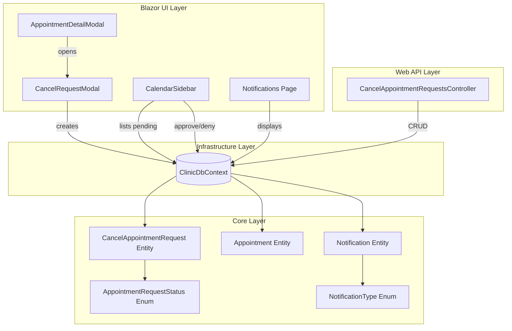
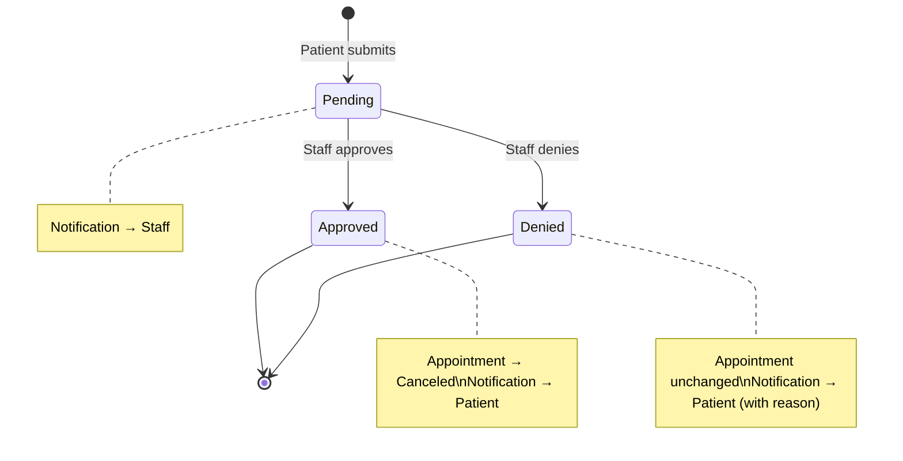

# Design Document: Cancel Appointment Request

## Overview

This feature adds a request-based cancellation workflow for appointments, mirroring the existing `AppointmentRequest` pattern. Patients submit a cancellation request with a reason, staff review and approve or deny it, and notifications are sent at each stage. The design reuses the existing `AppointmentRequestStatus` enum, the `Notification` entity, and the established modal/sidebar UI patterns.

### Key Design Decisions

- **Reuse `AppointmentRequestStatus`**: The existing `Pending/Approved/Denied` enum already matches the cancel request lifecycle. No new enum needed.
- **New `NotificationType` values**: Two new values (`CancellationRequested`, `CancellationApproved`, `CancellationDenied`) are added to distinguish cancel-related notifications from appointment-request notifications.
- **Inline service logic**: Following the existing pattern in `CalendarSidebar.razor` and `Schedule.razor`, the approve/deny logic lives in the code-behind of the UI components and the API controller rather than a separate service class. This keeps the pattern consistent.
- **Separate API controller**: A new `CancelAppointmentRequestsController` keeps the cancel request endpoints isolated from the existing `AppointmentsController`, following the single-responsibility principle.

## Architecture



### Request Lifecycle



## Components and Interfaces

### New Entity: `CancelAppointmentRequest`

**Location**: `ClinicScheduler.Core/Entities/CancelAppointmentRequest.cs`

Follows the `AppointmentRequest` pattern with private setters, a private EF constructor, and domain methods for state transitions.

```csharp
public class CancelAppointmentRequest
{
    public int Id { get; private set; }
    public int PatientId { get; private set; }
    public Patient Patient { get; private set; }
    public int AppointmentId { get; private set; }
    public Appointment Appointment { get; private set; }
    public string Reason { get; private set; }
    public AppointmentRequestStatus Status { get; private set; }
    public DateTime CreatedAt { get; private set; }
    public string? DenialReason { get; private set; }

    // EF constructor
    private CancelAppointmentRequest() { }

    // Domain constructor
    public CancelAppointmentRequest(Patient patient, Appointment appointment, string reason) { ... }

    public void Approve() { ... }   // Sets Status = Approved
    public void Deny(string reason) { ... }  // Sets Status = Denied, stores DenialReason
}
```

### New NotificationType Values

**Location**: `ClinicScheduler.Core/Entities/Notification.cs` (existing enum)

```csharp
public enum NotificationType
{
    // ... existing values ...
    CancellationRequested,
    CancellationApproved,
    CancellationDenied
}
```

### New API Controller: `CancelAppointmentRequestsController`

**Location**: `ClinicScheduler.Web/Api/CancelAppointmentRequestsController.cs`

| Method | Route | Description |
|--------|-------|-------------|
| `POST` | `api/cancel-appointment-requests` | Create a new cancel request |
| `GET` | `api/cancel-appointment-requests` | List all cancel requests (staff) |
| `GET` | `api/cancel-appointment-requests/{id}` | Get a single cancel request |

### New API Contracts

**Location**: `ClinicScheduler.Web/Contracts/CancelAppointmentRequests/`

- `CreateCancelAppointmentRequestDto` — `{ AppointmentId: int, Reason: string }`
- `CancelAppointmentRequestDto` — Response DTO with all fields

### New UI Component: `CancelRequestModal`

**Location**: `ClinicScheduler.Shared/Pages/CancelRequestModal.razor`

Follows the `RequestAppointmentModal` pattern: backdrop, panel, header with close button, read-only appointment context, required reason textarea, error display, and submit/cancel action buttons.

**Parameters**:
- `Appointment` — The appointment being requested for cancellation
- `OnClose` — EventCallback to close the modal
- `OnRequested` — EventCallback fired after successful submission

### Modified UI Components

| Component | Change |
|-----------|--------|
| `AppointmentDetailModal.razor` | Add "Request Cancellation" button for patients when appointment is Scheduled/Rescheduled and no pending cancel request exists. Show pending status when one exists. |
| `CalendarSidebar.razor` | Add "Pending Cancellations" section for staff role, with approve/deny actions (mirrors existing "Pending Requests" section). |
| `Notifications.razor` | Add icon/color mappings for `CancellationRequested`, `CancellationApproved`, `CancellationDenied` in the `TypeIcon` and `TypeColor` switch expressions. |

## Data Models

### CancelAppointmentRequest Table

| Column | Type | Constraints |
|--------|------|-------------|
| `Id` | `int` | PK, auto-increment |
| `PatientId` | `int` | FK → Patients, required |
| `AppointmentId` | `int` | FK → Appointments, required |
| `Reason` | `string` | Required, non-empty |
| `Status` | `AppointmentRequestStatus` | Default: Pending |
| `CreatedAt` | `DateTime` | Default: UTC now |
| `DenialReason` | `string?` | Nullable |

### DbContext Addition

```csharp
public DbSet<CancelAppointmentRequest> CancelAppointmentRequests => Set<CancelAppointmentRequest>();
```

### EF Migration

A new migration adds the `CancelAppointmentRequests` table with foreign keys to `Patients` and `Appointments`.

## Correctness Properties

*A property is a characteristic or behavior that should hold true across all valid executions of a system — essentially, a formal statement about what the system should do. Properties serve as the bridge between human-readable specifications and machine-verifiable correctness guarantees.*

### Property 1: Cancel request creation preserves all input fields

*For any* valid patient, eligible appointment (Scheduled or Rescheduled), and non-whitespace reason string, creating a `CancelAppointmentRequest` SHALL produce an entity with status `Pending`, the correct `PatientId`, the correct `AppointmentId`, the provided reason, and a `CreatedAt` timestamp.

**Validates: Requirements 1.5, 6.1**

### Property 2: Whitespace-only reasons are rejected

*For any* string composed entirely of whitespace characters (including empty string), attempting to create a cancel request or deny a cancel request with that string as the reason SHALL be rejected, and no state change SHALL occur.

**Validates: Requirements 1.6, 4.1**

### Property 3: Approval transitions both request and appointment

*For any* pending `CancelAppointmentRequest` linked to a Scheduled or Rescheduled appointment, approving the request SHALL set the request status to `Approved` AND transition the linked appointment status to `Canceled`.

**Validates: Requirements 3.2, 3.3**

### Property 4: Denial stores reason and preserves appointment status

*For any* pending `CancelAppointmentRequest` linked to an appointment, and any valid non-whitespace denial reason, denying the request SHALL set the request status to `Denied`, store the denial reason, and leave the linked appointment status unchanged.

**Validates: Requirements 4.2, 4.4**

### Property 5: Staff notification fan-out on creation

*For any* set of staff users and any newly created cancel request, the system SHALL create exactly one `CancellationRequested` notification per staff user.

**Validates: Requirements 2.1**

### Property 6: Notification messages contain required details

*For any* patient name, appointment date, and appointment time, the notification message created for a `CancellationRequested` notification SHALL contain the patient name, the formatted appointment date, and the formatted appointment time.

**Validates: Requirements 2.2**

### Property 7: Approval creates patient notification

*For any* approved cancel request, the system SHALL create exactly one notification of type `CancellationApproved` for the patient's user account.

**Validates: Requirements 3.4**

### Property 8: Denial creates patient notification with reason

*For any* denied cancel request with a denial reason, the system SHALL create exactly one notification of type `CancellationDenied` for the patient's user account, and the notification message SHALL contain the denial reason.

**Validates: Requirements 4.3**

### Property 9: Ineligible appointments are rejected

*For any* appointment with status `Completed`, `Canceled`, or `Missed`, attempting to create a cancel request SHALL be rejected and no `CancelAppointmentRequest` entity SHALL be created.

**Validates: Requirements 5.3**

## Error Handling

| Scenario | Behavior |
|----------|----------|
| Empty/whitespace cancellation reason | Modal shows inline validation error; API returns 400 Bad Request |
| Appointment not found | API returns 404 Not Found |
| Appointment not in Scheduled/Rescheduled status | API returns 409 Conflict with explanation |
| Duplicate pending cancel request for same appointment | API returns 409 Conflict with explanation |
| Patient record not found for authenticated user | Modal shows error message; no request created |
| Empty/whitespace denial reason | Staff UI shows inline validation error; deny action is blocked |
| Concurrent modification (request already approved/denied) | Approve/deny action shows snackbar error; sidebar refreshes |

## Testing Strategy

### Unit Tests (Example-Based)

Unit tests cover specific UI rendering scenarios and edge cases:

- **AppointmentDetailModal**: "Request Cancellation" button visibility for each `AppointmentStatus` value and viewer role
- **CancelRequestModal**: Read-only appointment context display, validation error on empty reason, successful submission flow
- **CalendarSidebar**: Pending cancellations section rendering for staff role
- **Notifications page**: Icon and color mapping for new `NotificationType` values
- **API controller**: 404 for missing appointment, 409 for ineligible status, 409 for duplicate pending request, 201 for successful creation

### Property-Based Tests

Property-based tests verify universal correctness properties using [FsCheck](https://fscheck.github.io/FsCheck/) (the standard PBT library for .NET/xUnit).

**Configuration**:
- Minimum 100 iterations per property test
- Each test references its design document property
- Tag format: **Feature: cancel-appointment-request, Property {number}: {property_text}**

Properties to implement:
1. Cancel request creation preserves all input fields (Property 1)
2. Whitespace-only reasons are rejected (Property 2)
3. Approval transitions both request and appointment (Property 3)
4. Denial stores reason and preserves appointment status (Property 4)
5. Staff notification fan-out on creation (Property 5)
6. Notification messages contain required details (Property 6)
7. Approval creates patient notification (Property 7)
8. Denial creates patient notification with reason (Property 8)
9. Ineligible appointments are rejected (Property 9)

### Integration Tests

Integration tests verify the API layer end-to-end:
- POST with valid data returns 201 and created resource
- POST for Completed appointment returns 409
- POST for appointment with existing pending request returns 409
- POST for non-existent appointment returns 404
