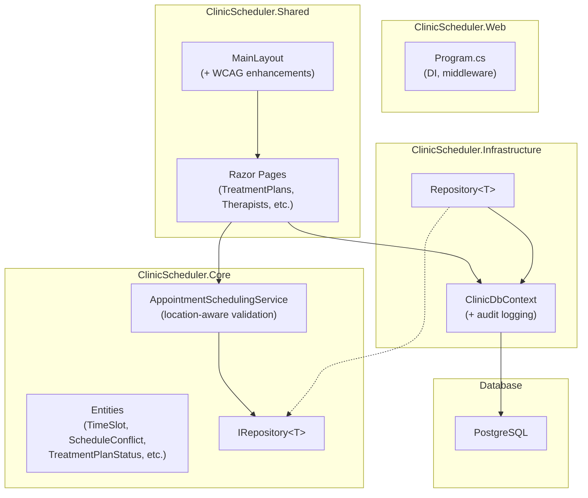
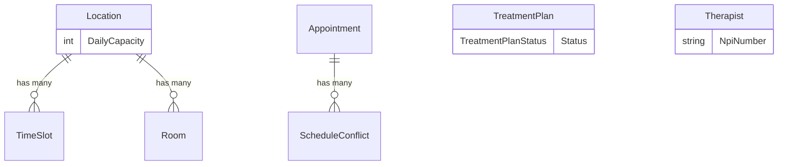

# Design Document: Gap Analysis Implementation

## Overview

This design addresses 10 requirements identified from a gap analysis between the ClinicScheduler system's original design specification and the current codebase. The changes span four categories:

1. **Domain Model Enhancements** (Requirements 1, 2, 4, 5, 8): New entities (`TimeSlot`, `ScheduleConflict`), new properties on existing entities (`TreatmentPlan.Status`, `Therapist.NpiNumber`, `Location.DailyCapacity`), and corresponding service/UI updates.
2. **Infrastructure** (Requirement 3): Automatic audit logging via `SaveChangesAsync` interception in `ClinicDbContext`.
3. **Accessibility** (Requirement 6): WCAG 2.1 Level AA compliance additions to the Blazor layout and pages.
4. **Documentation** (Requirements 7, 9, 10): Developer docs, admin guides, browser compatibility, and HTTPS deployment documentation.

The implementation follows the existing layered architecture: domain logic in `ClinicScheduler.Core`, persistence in `ClinicScheduler.Infrastructure`, shared UI in `ClinicScheduler.Shared`, and host configuration in `ClinicScheduler.Web`. All new entities follow the established patterns: private constructors for EF Core, validation in public constructors, `CreatedAt`/`UpdatedAt` timestamps, and domain methods for state transitions.

## Architecture

The existing architecture remains unchanged. New components slot into the established layers:



### Key Architectural Decisions

1. **TimeSlot replaces hardcoded hours**: The `AppointmentSchedulingService` currently uses `ClinicOpen`/`ClinicClose` constants. The new design queries `TimeSlot` records per location, falling back to the current defaults when none exist. This requires the service to accept a `Location` (or `locationId`) and access `TimeSlot` data via the repository.

2. **ScheduleConflict as a separate entity**: Rather than expanding the `Appointment` entity, conflicts get their own table with a one-to-many relationship from `Appointment`. The existing `HasConflict` boolean is retained for backward compatibility and kept in sync.

3. **Audit logging in SaveChangesAsync**: The existing `SaveChangesAsync` override already updates `UpdatedAt` timestamps. The audit logging logic extends this override to also create `AuditLog` entries from the `ChangeTracker`, excluding `AuditLog` entities themselves to prevent recursion.

4. **Documentation as Markdown files**: All documentation deliverables (Requirements 7, 9, 10) are Markdown files in a `docs/` folder at the repository root, following standard open-source conventions.

## Components and Interfaces

### New Entities

#### TimeSlot (Requirement 1)

```csharp
// ClinicScheduler.Core/Entities/TimeSlot.cs
public class TimeSlot
{
    public int Id { get; set; }
    public TimeOnly StartTime { get; private set; }
    public TimeOnly EndTime { get; private set; }
    public DayOfWeek DayOfWeek { get; private set; }
    public int LocationId { get; private set; }
    public Location Location { get; private set; } = null!;
    public DateTime CreatedAt { get; set; } = DateTime.UtcNow;
    public DateTime UpdatedAt { get; set; } = DateTime.UtcNow;

    private TimeSlot() { }

    public TimeSlot(TimeOnly startTime, TimeOnly endTime, DayOfWeek dayOfWeek, Location location)
    {
        // Validates startTime < endTime
        // Validates dayOfWeek is 0–6
        // Sets all properties
    }
}
```

#### ScheduleConflict (Requirement 2)

```csharp
// ClinicScheduler.Core/Entities/ScheduleConflict.cs
public enum ConflictType { DoubleBook, OutsideHours, Capacity }

public class ScheduleConflict
{
    public int Id { get; set; }
    public int AppointmentId { get; private set; }
    public Appointment Appointment { get; private set; } = null!;
    public DateTime DetectedAt { get; private set; }
    public ConflictType ConflictType { get; private set; }
    public bool Resolved { get; private set; }
    public DateTime? ResolvedAt { get; private set; }

    private ScheduleConflict() { }

    public ScheduleConflict(Appointment appointment, ConflictType conflictType) { ... }
    public void Resolve() { Resolved = true; ResolvedAt = DateTime.UtcNow; }
}
```

#### TreatmentPlanStatus (Requirement 4)

```csharp
// ClinicScheduler.Core/Entities/TreatmentPlanStatus.cs
public enum TreatmentPlanStatus { Active, Suspended, Ended }
```

### Modified Entities

#### TreatmentPlan (Requirement 4)

Add `Status` property with lifecycle methods:

```csharp
public TreatmentPlanStatus Status { get; private set; } = TreatmentPlanStatus.Active;

public void Suspend()
{
    if (Status == TreatmentPlanStatus.Ended)
        throw new InvalidOperationException("Cannot suspend an ended treatment plan.");
    Status = TreatmentPlanStatus.Suspended;
    UpdatedAt = DateTime.UtcNow;
}

public void End()
{
    Status = TreatmentPlanStatus.Ended;
    UpdatedAt = DateTime.UtcNow;
}

public void Reactivate()
{
    if (Status == TreatmentPlanStatus.Ended)
        throw new InvalidOperationException("Cannot reactivate an ended treatment plan.");
    Status = TreatmentPlanStatus.Active;
    UpdatedAt = DateTime.UtcNow;
}
```

#### Therapist (Requirement 5)

Add optional NPI number with validation:

```csharp
public string? NpiNumber { get; private set; }

public void SetNpiNumber(string? npiNumber)
{
    if (npiNumber is not null && !NpiNumberRegex().IsMatch(npiNumber))
        throw new ArgumentException("NPI number must be exactly 10 digits.", nameof(npiNumber));
    NpiNumber = npiNumber;
    UpdatedAt = DateTime.UtcNow;
}

[GeneratedRegex(@"^\d{10}$", RegexOptions.None, matchTimeoutMilliseconds: 1000)]
private static partial Regex NpiNumberRegex();
```

#### Location (Requirement 8)

Add daily capacity with validation:

```csharp
public int DailyCapacity { get; private set; } = 12;

public void SetDailyCapacity(int capacity)
{
    if (capacity <= 0)
        throw new ArgumentOutOfRangeException(nameof(capacity), "Daily capacity must be a positive integer.");
    DailyCapacity = capacity;
    UpdatedAt = DateTime.UtcNow;
}
```

Add `TimeSlots` navigation property:

```csharp
public ICollection<TimeSlot> TimeSlots { get; set; } = [];
```

#### Appointment (Requirement 2)

Add `ScheduleConflicts` navigation property:

```csharp
public ICollection<ScheduleConflict> ScheduleConflicts { get; set; } = [];
```

### Modified Services

#### AppointmentSchedulingService (Requirements 1, 2, 8)

The service needs access to `TimeSlot` and `Location` data. Changes:

1. **Constructor**: Add `IRepository<TimeSlot>` and `IRepository<Location>` dependencies.
2. **ValidateSlot**: Replace hardcoded `ClinicOpen`/`ClinicClose` with a location-aware method that queries `TimeSlot` records. If no records exist for the location, fall back to the current 8:00–17:00 weekday defaults.
3. **CreateAppointmentAsync**: Accept a `locationId` parameter (derived from the room's location). After validation, check location daily capacity using `Location.DailyCapacity` instead of the hardcoded `MaxConcurrentPatients` constant. Create `ScheduleConflict` records when conflicts are detected.
4. **Backward compatibility**: The existing `MaxConcurrentPatients` constant and `ValidateSlot(DateTime)` static method remain available but are marked as `[Obsolete]` to guide callers toward the new location-aware overloads.

### Modified Infrastructure

#### ClinicDbContext (Requirements 1, 2, 3)

1. **New DbSets**: `DbSet<TimeSlot>`, `DbSet<ScheduleConflict>`.
2. **OnModelCreating**: Configure `Location` → `TimeSlot` one-to-many, `Appointment` → `ScheduleConflict` one-to-many, unique filtered index on `Therapist.NpiNumber` (where not null).
3. **SaveChangesAsync**: Extend the existing override to iterate `ChangeTracker.Entries()` for `Added`, `Modified`, `Deleted` states, create `AuditLog` entries with change summaries, and exclude `AuditLog` entities from being audited.

### UI Changes

#### MainLayout (Requirement 6 — WCAG)

- Add a skip-navigation link (`<a href="#main-content" class="skip-nav">Skip to main content</a>`) as the first focusable element.
- Add `role="navigation"` to the sidebar/drawer element.
- Add `role="main"` and `id="main-content"` to the main content area.

#### Home.razor (Requirement 6 — WCAG)

- Add `role="region"` and `aria-label` attributes to stat card containers.
- Ensure icon buttons have `aria-label` attributes.

#### TreatmentPlans.razor (Requirement 4)

- Add a Status column to the data grid.
- Add status change controls (Suspend, End, Reactivate buttons) in the Actions column.
- Add Status display with color-coded chips.

#### Therapists.razor (Requirement 5)

- Add NPI Number field to the create/edit dialog.
- Display NPI Number in the data grid.

#### Location management UI (Requirement 8)

- Add DailyCapacity field to the location create/edit form.
- Display DailyCapacity in the locations list.

### Documentation Files (Requirements 7, 9, 10)

```
docs/
├── architecture.md          # Req 7.1 — layered structure, patterns, tech stack
├── setup-guide.md           # Req 7.2 — prerequisites, DB config, env vars, build/run
├── api-reference.md         # Req 7.3 — REST endpoints, methods, params, responses
├── user-guide.md            # Req 7.4 — user mgmt, scheduling, treatment plans, reports
├── browser-compatibility.md # Req 9 — supported browsers, breakpoints, testing checklist
└── deployment-https.md      # Req 10 — HTTPS termination, TLS flow, LB config
```

## Data Models

### New Tables

#### TimeSlots

| Column     | Type      | Constraints                          |
|------------|-----------|--------------------------------------|
| Id         | int       | PK, auto-increment                   |
| StartTime  | TimeOnly  | NOT NULL, CHECK (StartTime < EndTime)|
| EndTime    | TimeOnly  | NOT NULL                             |
| DayOfWeek  | int       | NOT NULL, CHECK (0–6)                |
| LocationId | int       | FK → Locations.Id, NOT NULL          |
| CreatedAt  | DateTime  | NOT NULL, default UTC now            |
| UpdatedAt  | DateTime  | NOT NULL, default UTC now            |

#### ScheduleConflicts

| Column        | Type         | Constraints                     |
|---------------|--------------|----------------------------------|
| Id            | int          | PK, auto-increment              |
| AppointmentId | int          | FK → Appointments.Id, NOT NULL  |
| DetectedAt    | DateTime     | NOT NULL, default UTC now       |
| ConflictType  | int (enum)   | NOT NULL (0=DoubleBook, 1=OutsideHours, 2=Capacity) |
| Resolved      | bool         | NOT NULL, default false         |
| ResolvedAt    | DateTime?    | NULL                            |

### Modified Tables

#### TreatmentPlans

| Column | Type       | Change                                    |
|--------|------------|-------------------------------------------|
| Status | int (enum) | NEW — NOT NULL, default 0 (Active)        |

#### Therapists

| Column    | Type    | Change                                         |
|-----------|---------|-------------------------------------------------|
| NpiNumber | string? | NEW — nullable, unique filtered index (non-null)|

#### Locations

| Column        | Type | Change                              |
|---------------|------|-------------------------------------|
| DailyCapacity | int  | NEW — NOT NULL, default 12          |

### Entity Relationship Additions



### Migration Strategy

A single EF Core migration will be generated to:
1. Create `TimeSlots` and `ScheduleConflicts` tables.
2. Add `Status` column to `TreatmentPlans` (default `0` = Active for existing rows).
3. Add `NpiNumber` column to `Therapists` (nullable, with unique filtered index).
4. Add `DailyCapacity` column to `Locations` (default `12` for existing rows).

Existing data is preserved — all new columns have sensible defaults, and new tables start empty.


## Correctness Properties

*A property is a characteristic or behavior that should hold true across all valid executions of a system — essentially, a formal statement about what the system should do. Properties serve as the bridge between human-readable specifications and machine-verifiable correctness guarantees.*

### Property 1: TimeSlot construction validates and preserves inputs

*For any* pair of `TimeOnly` values (startTime, endTime), any `DayOfWeek` value, and any valid `Location`, constructing a `TimeSlot` succeeds if and only if startTime < endTime. When construction succeeds, the resulting entity's `StartTime`, `EndTime`, `DayOfWeek`, and `LocationId` match the provided inputs exactly.

**Validates: Requirements 1.1, 1.2**

### Property 2: Scheduling service validates appointment times against location TimeSlots

*For any* set of `TimeSlot` records for a location and any appointment start time, the scheduling service accepts the appointment if and only if the start time falls within one of the location's configured time slots for that day of week. When no TimeSlot records exist, the service accepts times within the default 8:00 AM–5:00 PM weekday schedule.

**Validates: Requirements 1.5, 1.6**

### Property 3: ScheduleConflict construction preserves all fields

*For any* valid `Appointment` and any `ConflictType` value, constructing a `ScheduleConflict` produces an entity with the correct `AppointmentId`, `ConflictType`, `Resolved` set to false, `ResolvedAt` set to null, and a `DetectedAt` timestamp within the construction window.

**Validates: Requirements 2.1**

### Property 4: ScheduleConflict resolution sets flag and timestamp

*For any* unresolved `ScheduleConflict`, calling `Resolve()` sets `Resolved` to true and `ResolvedAt` to a non-null `DateTime` within the resolution window.

**Validates: Requirements 2.4**

### Property 5: AuditLog construction preserves all fields

*For any* entity name string, entity ID string, `AuditAction` value, and optional change summary string, constructing an `AuditLog` produces an entry where `EntityName`, `EntityId`, `Action`, and `ChangeSummary` match the inputs, and `Timestamp` is within the construction window.

**Validates: Requirements 3.2**

### Property 6: Change summary formatting contains all property changes

*For any* set of (propertyName, oldValue, newValue) triples, the formatted change summary string contains every property name, every old value, and every new value from the input set.

**Validates: Requirements 3.3**

### Property 7: New TreatmentPlan starts with Active status

*For any* valid patient, therapist, frequency (2, 3, or 4), duration (20, 30, or 50), and start date, a newly constructed `TreatmentPlan` has `Status` equal to `TreatmentPlanStatus.Active`.

**Validates: Requirements 4.3**

### Property 8: TreatmentPlan valid status transitions update state and timestamp

*For any* `TreatmentPlan` with status `Active` or `Suspended`, calling `Suspend()` (from Active) sets status to `Suspended`, calling `End()` (from Active or Suspended) sets status to `Ended`, and calling `Reactivate()` (from Suspended) sets status to `Active`. In all cases, `UpdatedAt` is updated to a timestamp within the transition window.

**Validates: Requirements 4.4, 4.5**

### Property 9: Ended TreatmentPlan rejects status changes

*For any* `TreatmentPlan` with status `Ended`, calling `Suspend()` or `Reactivate()` throws `InvalidOperationException`, and the plan's `Status` remains `Ended`.

**Validates: Requirements 4.6**

### Property 10: NPI number validation accepts exactly 10-digit strings

*For any* string, `SetNpiNumber()` succeeds if and only if the string matches the pattern `^\d{10}$`. When it succeeds, the `NpiNumber` property equals the input. When it fails, `ArgumentException` is thrown and `NpiNumber` is unchanged. Null inputs are always accepted.

**Validates: Requirements 5.2**

### Property 11: Location DailyCapacity validation and defaults

*For any* newly constructed `Location`, `DailyCapacity` defaults to 12. *For any* integer value, `SetDailyCapacity()` succeeds if and only if the value is greater than zero. When it succeeds, `DailyCapacity` equals the input. When it fails, `ArgumentOutOfRangeException` is thrown and `DailyCapacity` is unchanged.

**Validates: Requirements 8.1, 8.5**

## Error Handling

### Entity Validation Errors

| Entity / Method | Error Condition | Exception | Message |
|---|---|---|---|
| `TimeSlot` constructor | `startTime >= endTime` | `ArgumentException` | "Start time must be earlier than end time." |
| `TimeSlot` constructor | Invalid `DayOfWeek` cast | `ArgumentOutOfRangeException` | "Day of week must be between Sunday (0) and Saturday (6)." |
| `ScheduleConflict.Resolve()` | Already resolved | `InvalidOperationException` | "Conflict is already resolved." |
| `TreatmentPlan.Suspend()` | Status is `Ended` | `InvalidOperationException` | "Cannot suspend an ended treatment plan." |
| `TreatmentPlan.Reactivate()` | Status is `Ended` | `InvalidOperationException` | "Cannot reactivate an ended treatment plan." |
| `Therapist.SetNpiNumber()` | Not exactly 10 digits | `ArgumentException` | "NPI number must be exactly 10 digits." |
| `Location.SetDailyCapacity()` | Value ≤ 0 | `ArgumentOutOfRangeException` | "Daily capacity must be a positive integer." |

### Service-Level Errors

| Service Method | Error Condition | Exception | Message |
|---|---|---|---|
| `CreateAppointmentAsync` | Appointment outside location TimeSlots | `ArgumentException` | "Appointment time is outside the configured schedule for this location." |
| `CreateAppointmentAsync` | Location daily capacity exceeded | `InvalidOperationException` | "Location daily capacity reached: cannot schedule more than {capacity} patients on this date." |

### Audit Logging Errors

The audit logging in `SaveChangesAsync` is wrapped in a try-catch to prevent audit failures from blocking the primary save operation. If audit log creation fails, the error is logged via `ILogger` but the original `SaveChangesAsync` proceeds. This ensures audit logging is best-effort and does not compromise data integrity.

### UI Error Handling

All Blazor page operations that modify data use try-catch blocks with error messages displayed via `MudSnackbar` (existing pattern). Validation errors from entity constructors surface as user-friendly messages in dialog forms via the existing `_errorMessage` pattern.

## Testing Strategy

### Testing Framework

The project already uses:
- **xUnit** as the test runner
- **FluentAssertions** for assertion syntax
- **FsCheck + FsCheck.Xunit** for property-based testing
- **Moq** for mocking
- **Microsoft.EntityFrameworkCore.InMemory** for integration tests

All new tests follow these existing conventions.

### Property-Based Tests (FsCheck)

Each correctness property maps to a single FsCheck property test with a minimum of 100 iterations. Tests are placed in `ClinicScheduler.Core.Tests/Entities/` following the existing pattern (see `CancelAppointmentRequestPropertyTests.cs`).

| Property | Test Class | Tag |
|---|---|---|
| Property 1 | `TimeSlotPropertyTests` | Feature: gap-analysis-implementation, Property 1: TimeSlot construction validates and preserves inputs |
| Property 2 | `AppointmentSchedulingPropertyTests` | Feature: gap-analysis-implementation, Property 2: Scheduling validates against location TimeSlots |
| Property 3 | `ScheduleConflictPropertyTests` | Feature: gap-analysis-implementation, Property 3: ScheduleConflict construction preserves all fields |
| Property 4 | `ScheduleConflictPropertyTests` | Feature: gap-analysis-implementation, Property 4: ScheduleConflict resolution sets flag and timestamp |
| Property 5 | `AuditLogPropertyTests` | Feature: gap-analysis-implementation, Property 5: AuditLog construction preserves all fields |
| Property 6 | `AuditLogPropertyTests` | Feature: gap-analysis-implementation, Property 6: Change summary formatting contains all property changes |
| Property 7 | `TreatmentPlanStatusPropertyTests` | Feature: gap-analysis-implementation, Property 7: New TreatmentPlan starts Active |
| Property 8 | `TreatmentPlanStatusPropertyTests` | Feature: gap-analysis-implementation, Property 8: Valid status transitions update state |
| Property 9 | `TreatmentPlanStatusPropertyTests` | Feature: gap-analysis-implementation, Property 9: Ended plan rejects status changes |
| Property 10 | `TherapistNpiPropertyTests` | Feature: gap-analysis-implementation, Property 10: NPI validation accepts exactly 10-digit strings |
| Property 11 | `LocationCapacityPropertyTests` | Feature: gap-analysis-implementation, Property 11: DailyCapacity validation and defaults |

### Unit Tests (xUnit + FluentAssertions)

Example-based tests for specific scenarios and edge cases:

- **TimeSlot**: Default fallback behavior when no slots configured (Req 1.6)
- **ScheduleConflict**: HasConflict sync with ScheduleConflicts collection (Req 2.6)
- **TreatmentPlan**: Status display in UI model (Req 4.7)
- **Therapist**: NPI field in create/edit flow (Req 5.3)

### Integration Tests (InMemory EF Core)

- **Audit logging**: Verify `SaveChangesAsync` creates AuditLog entries for Added/Modified/Deleted entities (Req 3.1, 3.4, 3.5, 3.6)
- **DbContext configuration**: Verify new DbSets, relationships, and indexes (Req 1.4, 2.5, 5.4)
- **Scheduling service**: Verify location-aware capacity enforcement with mock repositories (Req 8.2)

### Accessibility Testing (Requirement 6)

WCAG 2.1 compliance requires manual testing with assistive technologies and expert accessibility review. Automated checks can verify:
- Skip-nav link presence and `href` target
- ARIA role attributes on layout elements
- `aria-label` attributes on icon buttons

Full WCAG validation requires manual testing with screen readers (NVDA, VoiceOver) and keyboard-only navigation.

### Documentation Review (Requirements 7, 9, 10)

Documentation deliverables are reviewed for completeness against acceptance criteria. No automated tests — peer review ensures accuracy and coverage.
