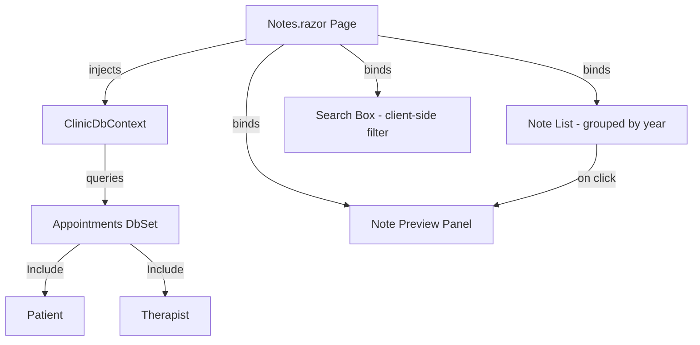

# Design Document: Wire Notes Page

## Overview

This design replaces the hardcoded mock data on the Notes page (`/notes`) with real database queries using Entity Framework Core. The page will query `ClinicDbContext.Appointments` for records with non-null `Notes` fields, eagerly loading related `Patient` and `Therapist` entities. Notes will be displayed in a scrollable list grouped by year, with client-side search/filter and a detail preview panel — following the same data access patterns established by the `PatientDashboard` page.

The change is scoped entirely to the `Notes.razor` component in `ClinicScheduler.Shared/Pages`. No new entities, migrations, or API endpoints are needed — the existing `Appointment`, `Patient`, and `Therapist` entities already contain all required data.

## Architecture

The Notes page operates as a server-rendered Blazor component with direct `ClinicDbContext` injection. There is no service layer or repository abstraction for this page — it follows the same pattern as `PatientDashboard.razor`, which injects `ClinicDbContext` directly and queries in `OnInitializedAsync`.



**Data flow:**
1. On page load (`OnInitializedAsync`), query all appointments with non-null `Notes`, including `Patient` and `Therapist`.
2. Store results in a `List<Appointment>` field.
3. Render the list grouped by `StartTime.Year`, ordered descending.
4. Search filtering happens client-side against the in-memory list — no additional DB queries.
5. Clicking a note entry sets a `selectedAppointment` field, which drives the preview panel.

## Components and Interfaces

### Notes.razor Component

This is the single component being modified. No new components are introduced.

**Injected dependencies:**
- `ClinicDbContext DbContext` — for data access (same pattern as `PatientDashboard`)

**Component state fields:**

| Field | Type | Purpose |
|---|---|---|
| `_appointments` | `List<Appointment>` | All appointments with notes, loaded once on init |
| `_searchText` | `string` | Current search box value |
| `_selectedAppointment` | `Appointment?` | Currently selected note for preview (null = no selection) |
| `_isLoading` | `bool` | True while data is being fetched |

**Computed properties:**

| Property | Type | Purpose |
|---|---|---|
| `FilteredNotes` | `IEnumerable<Appointment>` | Appointments filtered by `_searchText` against note text, patient name, and therapist name (case-insensitive) |
| `GroupedByYear` | `IEnumerable<IGrouping<int, Appointment>>` | `FilteredNotes` grouped by `StartTime.Year`, ordered descending |

**Key methods:**

| Method | Description |
|---|---|
| `OnInitializedAsync()` | Queries DB for appointments with notes, sets `_isLoading` |
| `SelectNote(Appointment)` | Sets `_selectedAppointment` to the clicked note |

### No New Interfaces or Services

The design intentionally avoids introducing a service layer or repository for this feature. The `PatientDashboard` page demonstrates that direct `ClinicDbContext` injection is the established pattern in this codebase for page-level data access. Adding an abstraction layer would be inconsistent with the existing architecture.

## Data Models

### Existing Entities (No Changes)

**Appointment** (key fields for this feature):
- `Id: int` — primary key
- `PatientId: int` — FK to Patient
- `Patient: Patient` — navigation property
- `TherapistId: int` — FK to Therapist
- `Therapist: Therapist` — navigation property
- `StartTime: DateTime` — appointment date/time
- `Notes: string?` — clinical note text (null means no note)

**Patient** (key fields):
- `Id: int`
- `FirstName: string`
- `LastName: string`
- `FullName: string` — computed property (`FirstName LastName`)

**Therapist** (key fields):
- `Id: int`
- `FirstName: string`
- `LastName: string`
- `FullName: string` — computed property (`FirstName LastName`)

### EF Core Query

The core query follows the `PatientDashboard` pattern:

```csharp
_appointments = await DbContext.Appointments
    .Include(a => a.Patient)
    .Include(a => a.Therapist)
    .Where(a => a.Notes != null)
    .OrderByDescending(a => a.StartTime)
    .ToListAsync();
```

No new database tables, columns, or migrations are required.


## Correctness Properties

*A property is a characteristic or behavior that should hold true across all valid executions of a system — essentially, a formal statement about what the system should do. Properties serve as the bridge between human-readable specifications and machine-verifiable correctness guarantees.*

### Property 1: Year-grouped ordering preserves descending chronological order

*For any* list of appointments with non-null notes, grouping by `StartTime.Year` shall produce year groups in descending order, and within each year group, appointments shall be ordered by `StartTime` descending (most recent first).

**Validates: Requirements 1.4, 2.1, 2.2, 2.3**

### Property 2: Search filter returns exactly the matching notes

*For any* search text and any list of appointments with notes, the filtered result shall contain every appointment where the note text, patient full name, or therapist full name contains the search text (case-insensitive), and shall exclude every appointment where none of those fields contain the search text.

**Validates: Requirements 3.2, 3.3**

### Property 3: Note preview contains all required fields

*For any* appointment with a non-null note, patient, and therapist, selecting that appointment shall produce preview data that includes the full note text, the patient's full name, the therapist's full name, and the appointment date.

**Validates: Requirements 4.1**

### Property 4: Preview date format includes day, month, and year

*For any* appointment date, the human-readable preview format shall contain the numeric day, the month name (or abbreviation), and the four-digit year.

**Validates: Requirements 4.4**

### Property 5: List entry date format matches abbreviated month and day

*For any* appointment date, the list entry date format shall produce a string matching the abbreviated month name followed by the day number (e.g., "Mar 1", "Dec 15").

**Validates: Requirements 5.1**

### Property 6: Text truncation respects maximum length

*For any* note text string, the truncated preview shall never exceed the defined maximum character length. Note texts shorter than or equal to the maximum length shall be returned unchanged. Note texts longer than the maximum shall be truncated and end with an ellipsis indicator.

**Validates: Requirements 5.2**

## Error Handling

| Scenario | Handling |
|---|---|
| **Database query fails** | Catch exceptions in `OnInitializedAsync`, set an error flag, display a user-friendly error message instead of the note list. Log the exception. |
| **No appointments with notes** | Display "No clinical notes are available." message (Requirement 1.5). This is a normal state, not an error. |
| **Search returns no results** | Display "No notes match the search criteria." message (Requirement 3.4). |
| **Null Patient or Therapist on an appointment** | Defensive null checks in rendering. Display "Unknown Patient" or "Unknown Therapist" if navigation properties are unexpectedly null despite `Include()`. |
| **Loading state** | Show a loading indicator (`_isLoading = true`) while `OnInitializedAsync` runs. The UI should not render the note list or "no notes" message until loading completes. |

## Testing Strategy

### Unit Tests (Example-Based)

Unit tests cover specific scenarios, edge cases, and UI rendering concerns:

- **Empty state**: No appointments with notes → "no notes" message displayed
- **Search empty results**: Search text matches nothing → "no matches" message displayed
- **Initial preview state**: No note selected → placeholder message displayed
- **Selection highlight**: Selected note entry has active CSS class
- **Patient name in list entry**: Note entry renders patient full name
- **Loading state**: Loading indicator shown before data loads
- **Include verification**: Loaded appointments have non-null Patient and Therapist

### Property-Based Tests

Property-based tests verify universal correctness properties using **FsCheck** (via `FsCheck.Xunit`) integrated with the existing xUnit test framework. Each property test runs a minimum of 100 iterations.

The properties test pure logic extracted from the Razor component — grouping, filtering, formatting, and truncation functions — without requiring Blazor rendering infrastructure.

| Property | What It Tests | Tag |
|---|---|---|
| Property 1 | Year-grouped ordering | `Feature: wire-notes-page, Property 1: Year-grouped ordering preserves descending chronological order` |
| Property 2 | Search filter correctness | `Feature: wire-notes-page, Property 2: Search filter returns exactly the matching notes` |
| Property 3 | Preview data completeness | `Feature: wire-notes-page, Property 3: Note preview contains all required fields` |
| Property 4 | Preview date formatting | `Feature: wire-notes-page, Property 4: Preview date format includes day, month, and year` |
| Property 5 | List entry date formatting | `Feature: wire-notes-page, Property 5: List entry date format matches abbreviated month and day` |
| Property 6 | Text truncation | `Feature: wire-notes-page, Property 6: Text truncation respects maximum length` |

### Test Architecture Decision

To make the filtering, grouping, formatting, and truncation logic testable without Blazor rendering, these operations should be implemented as static helper methods or computed properties that operate on plain `List<Appointment>` and `string` inputs. The Razor component calls these helpers, and tests exercise them directly.

This avoids the need for bUnit or Blazor test host infrastructure while still verifying the core logic that the requirements specify.

### Integration Tests

Integration tests verify the EF Core query against a real database (using the existing Testcontainers PostgreSQL fixture):

- Query returns only appointments with non-null `Notes`
- Query eagerly loads `Patient` and `Therapist` navigation properties
- Query orders results by `StartTime` descending
