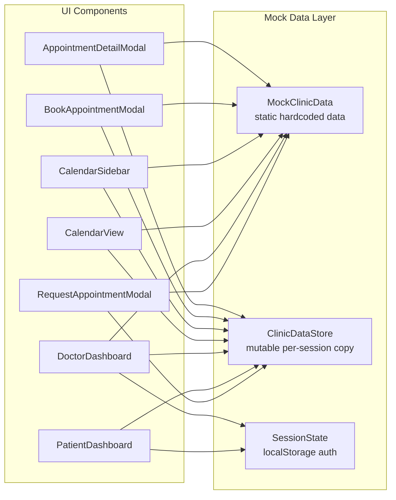
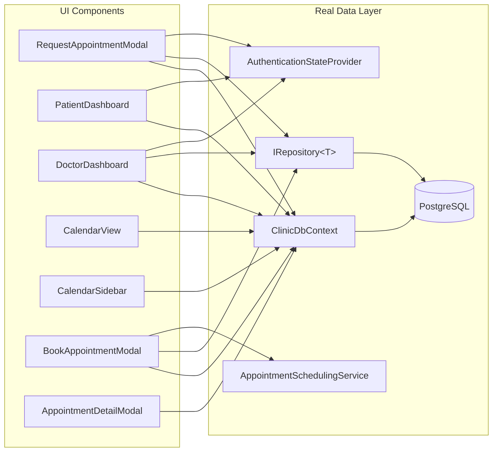

# Design Document: Wire UI to API

## Overview

This feature replaces all in-memory mock data dependencies (`ClinicDataStore`, `MockClinicData`, `SessionState`) in four UI components with real database services, following the established Blazor Server patterns already used by Home.razor and Schedule.razor.

The components to wire are:
- **RequestAppointmentModal** — creates `AppointmentRequest` entities instead of mock `Appointment` records
- **PatientDashboard** — queries real `Patient`, `Appointment`, and notes data via `ClinicDbContext`
- **DoctorDashboard** — queries real `Therapist`, `Patient`, and `Appointment` data via `ClinicDbContext`
- **CalendarView** (+ CalendarSidebar, BookAppointmentModal, AppointmentDetailModal) — displays real appointments from the database

After wiring, `ClinicDataStore.cs`, `MockClinicData.cs`, and their registrations are removed.

### Design Rationale

This is a Blazor Server app using `InteractiveServer` render mode. Pages inject services directly — no `HttpClient` or API calls are needed from the UI layer. The existing working pages (Home.razor, Schedule.razor) demonstrate the pattern:
- Inject `IRepository<T>`, `ClinicDbContext`, `AuthenticationStateProvider`, `ISnackbar`
- Use `AuthenticationStateProvider` to get the current user's email
- Query the database using `ClinicDbContext` with EF Core LINQ
- Use `ISnackbar` (MudBlazor) for user feedback

All wired components will follow this same pattern exactly.

## Architecture

### Current State

### Target State

### Key Architectural Decisions

1. **Direct service injection over HttpClient**: Since this is Blazor Server with `InteractiveServer` render mode, all components run on the server and can inject services directly. No API layer is needed between UI and data.

2. **ClinicDbContext for complex queries, IRepository for simple CRUD**: Following the existing pattern in Home.razor and Schedule.razor, use `ClinicDbContext` directly when queries need `.Include()`, `.Where()`, or complex joins. Use `IRepository<T>` for simple lookups like `GetAllAsync()` or `GetByIdAsync()`.

3. **AuthenticationStateProvider replaces SessionState**: The real ASP.NET Core Identity system is already configured. `AuthenticationStateProvider` provides the authenticated user's email, which maps to `Patient.Email` or `Therapist.Email` in the database.

4. **CalendarView becomes a parameter-driven component**: Instead of querying `ClinicDataStore` internally, CalendarView will receive appointments as a parameter from its parent (PatientDashboard or DoctorDashboard), or query `ClinicDbContext` directly. The parent is responsible for providing the correct filter context (patient ID or therapist ID).

5. **BookAppointmentModal uses AppointmentSchedulingService**: Staff booking through the calendar should use the same `AppointmentSchedulingService.CreateAppointmentAsync()` that Schedule.razor uses, ensuring consistent validation (slot rules, conflict detection, capacity limits).

## Components and Interfaces

### 1. RequestAppointmentModal

**Current injections:** `ClinicDataStore`
**New injections:** `ClinicDbContext`, `IRepository<Therapist>`, `AuthenticationStateProvider`, `ISnackbar`

**Changes:**
- Replace `MockClinicData.Doctors` dropdown with therapists loaded from `IRepository<Therapist>.GetAllAsync()`
- On submit: resolve the current patient via `AuthenticationStateProvider` → email → `DbContext.Patients.FirstOrDefaultAsync(p => p.Email == email)`
- Create an `AppointmentRequest` entity (not an `Appointment`) using the existing constructor: `new AppointmentRequest(patient, notes, preferredTherapist)`
- Call `request.SetPreferredDateTime(preferredDateTime)` to store the preferred date/time
- Persist via `DbContext.AppointmentRequests.Add(request)` + `SaveChangesAsync()`
- Show success via `ISnackbar`
- Remove the doctor/type/start-time/end-time fields that don't map to `AppointmentRequest`; align form fields with what Home.razor's patient request dialog already uses (preferred therapist, preferred date, preferred time, reason/notes)

**Form field mapping:**
| Form Field | Entity Property |
|---|---|
| Therapist selection (optional) | `AppointmentRequest.PreferredTherapistId` |
| Preferred date + time | `AppointmentRequest.PreferredDateTime` |
| Reason for visit | `AppointmentRequest.Notes` |
| (from auth) | `AppointmentRequest.PatientId` |

### 2. PatientDashboard

**Current injections:** `NavigationManager`, `SessionState`, `ClinicDataStore`
**New injections:** `NavigationManager`, `ClinicDbContext`, `IRepository<Therapist>`, `AuthenticationStateProvider`, `ISnackbar`

**Changes:**
- Replace `SessionState` authentication check with `AuthenticationStateProvider` + `[Authorize(Roles = "Patient")]` attribute
- Resolve patient: `AuthenticationStateProvider` → email → `DbContext.Patients.FirstOrDefaultAsync(p => p.Email == email)`
- Calendar tab: pass real `Patient.Id` (int) to CalendarView; CalendarView queries `DbContext.Appointments` filtered by patient ID and week range
- Profile tab: bind form fields to `Patient` entity properties (`FullName`, `Phone`, `Email`, `DateOfBirth`). Save via `Patient.UpdateContactInfo()` + `DbContext.SaveChangesAsync()`
- Notes tab: query `DbContext.Appointments.Where(a => a.PatientId == patientId && a.Notes != null)` to show appointment notes
- Remove sign-out button (handled by the app's auth system, not per-dashboard)
- Replace mock `MockClinicData.Patient` type references with real `Patient` entity

### 3. DoctorDashboard

**Current injections:** `NavigationManager`, `SessionState`, `ClinicDataStore`
**New injections:** `NavigationManager`, `ClinicDbContext`, `IRepository<Patient>`, `IRepository<Therapist>`, `AuthenticationStateProvider`, `ISnackbar`

**Changes:**
- Replace `SessionState` authentication check with `AuthenticationStateProvider` + `[Authorize(Roles = "Therapist")]` attribute
- Resolve therapist: `AuthenticationStateProvider` → email → `DbContext.Therapists.FirstOrDefaultAsync(t => t.Email == email)`
- Calendar tab: pass real `Therapist.Id` (int) to CalendarView; CalendarView queries appointments filtered by therapist ID
- Patient search tab: query `IRepository<Patient>.FindAsync(p => p.FullName.Contains(searchTerm))` or use `DbContext.Patients.Where(...)` with case-insensitive search
- Notes tab: query appointments for this therapist that have notes: `DbContext.Appointments.Include(a => a.Patient).Where(a => a.TherapistId == therapistId && a.Notes != null)`
- Patient detail modal: display real `Patient` entity properties
- Remove sign-out button

### 4. CalendarView + Sub-Components

**CalendarView** — **Current injections:** `ClinicDataStore`
**New injections:** `ClinicDbContext`

**Changes:**
- Replace `MockClinicData.Appointment` type with real `Appointment` entity throughout
- Replace `Data.Appointments` queries with `DbContext.Appointments.Include(a => a.Patient).Include(a => a.Therapist).Include(a => a.Room).Where(...)` filtered by week range and viewer context
- Change parameters from `string? PatientId` / `string? DoctorId` to `int? PatientId` / `int? TherapistId` (matching real entity IDs)
- The `ForViewer()` method becomes an async DB query instead of in-memory LINQ
- Appointment card subtitle uses navigation properties (`a.Patient.FullName`, `a.Therapist.FullName`) instead of mock lookups

**CalendarSidebar** — **Current injections:** `ClinicDataStore`
**New injections:** `ClinicDbContext`

**Changes:**
- Replace all `MockClinicData.Appointment` references with real `Appointment` entity
- Replace `Data.Appointments` queries with `DbContext.Appointments` queries
- Pending requests section (staff view): query `DbContext.AppointmentRequests.Where(r => r.Status == Pending)` instead of filtering mock appointments by status
- Confirm/Decline actions: use `AppointmentSchedulingService` for approval (matching Home.razor pattern) and `AppointmentRequest.Deny()` for decline
- Recent/Upcoming/Follow-up lists: query `DbContext.Appointments` with appropriate filters
- Change parameter types from `string?` to `int?` for PatientId/TherapistId

**BookAppointmentModal** — **Current injections:** `ClinicDataStore`
**New injections:** `ClinicDbContext`, `IRepository<Patient>`, `IRepository<Therapist>`, `IRepository<Room>`, `AppointmentSchedulingService`, `ISnackbar`

**Changes:**
- Replace mock patient/doctor dropdowns with real `Patient` and `Therapist` lists from repositories
- On submit: use `AppointmentSchedulingService.CreateAppointmentAsync()` (same as Schedule.razor) instead of `Data.AddAppointment()`
- Add room selection (required by `CreateAppointmentAsync`)
- Remove free-text location/room fields; use real `Room` entities from the database

**AppointmentDetailModal** — **Current injections:** `ClinicDataStore`
**New injections:** `ClinicDbContext`

**Changes:**
- Change `Appointment` parameter type from `MockClinicData.Appointment` to real `Appointment` entity
- Replace `Data.GetPatient()` / `MockClinicData.Doctors.FirstOrDefault()` lookups with navigation properties (`Appointment.Patient.FullName`, `Appointment.Therapist.FullName`)
- Doctor notes: save via `Appointment.Notes` property + `DbContext.SaveChangesAsync()`
- Staff confirm/decline: these actions should be removed from this modal (the real approval flow is on Home.razor's staff dashboard, not in the calendar detail view)

### 5. Cleanup

- Delete `ClinicScheduler/ClinicScheduler.Shared/Services/ClinicDataStore.cs`
- Delete `ClinicScheduler/ClinicScheduler.Shared/Services/MockClinicData.cs`
- Remove `builder.Services.AddScoped<ClinicDataStore>()` from `ClinicScheduler.Web/Program.cs`
- Remove `builder.Services.AddScoped<ClinicDataStore>()` from `ClinicScheduler.Web.Client/Program.cs`
- Remove `using ClinicScheduler.Shared.Services` where it was only needed for mock types
- Verify `SessionState` is still needed by other components; if not, remove its registration too

## Data Models

No new entities or schema changes are required. All data models already exist:

### Existing Entities Used

| Entity | Key Properties | Used By |
|---|---|---|
| `Patient` | `Id`, `FirstName`, `LastName`, `Email`, `Phone`, `DateOfBirth`, `Notes` | PatientDashboard, DoctorDashboard, CalendarView |
| `Therapist` | `Id`, `FirstName`, `LastName`, `Email`, `Specialty`, `FullName` | RequestAppointmentModal, DoctorDashboard, CalendarView |
| `Appointment` | `Id`, `PatientId`, `TherapistId`, `RoomId`, `StartTime`, `EndTime`, `Status`, `Notes` | All calendar components |
| `AppointmentRequest` | `Id`, `PatientId`, `PreferredTherapistId`, `PreferredDateTime`, `Notes`, `Status` | RequestAppointmentModal, CalendarSidebar |
| `Room` | `Id`, `Name` | BookAppointmentModal, CalendarView |
| `Notification` | `Id`, `UserId`, `Type`, `Title`, `Message` | Request submission feedback |

### Type Mapping: Mock → Real

| Mock Type | Real Entity | ID Type Change |
|---|---|---|
| `MockClinicData.Patient` | `Patient` | `string` → `int` |
| `MockClinicData.Doctor` | `Therapist` | `string` → `int` |
| `MockClinicData.Appointment` | `Appointment` | `string` → `int` |
| `MockClinicData.Note` | `Appointment.Notes` (string property) | N/A — notes are on the Appointment entity |
| `SessionState.Role` | `AuthenticationStateProvider` + `[Authorize]` | N/A |

### Key Differences from Mock Data

1. **Notes are on Appointment, not separate entities**: The mock had a separate `Note` record type. In the real schema, notes are stored as `Appointment.Notes` (a string property on the Appointment entity). The notes tabs will query appointments that have non-null Notes.

2. **IDs are integers, not strings**: All entity IDs are `int`, not `string`. CalendarView parameters change from `string? PatientId` to `int? PatientId`.

3. **No "type" field on Appointment**: The mock had a `Type` field (medical/lab/intake/admin). The real `Appointment` entity has a `TherapyType` navigation property instead. Calendar color-coding will use `TherapyType.ColorCode` or `AppointmentStatus`.

4. **AppointmentRequest vs Appointment for pending items**: The mock stored pending requests as `Appointment` records with `Status = "pending"`. The real system uses a separate `AppointmentRequest` entity. The CalendarSidebar's "Pending Requests" section will query `AppointmentRequests` instead of filtering appointments.

## Correctness Properties

*A property is a characteristic or behavior that should hold true across all valid executions of a system — essentially, a formal statement about what the system should do. Properties serve as the bridge between human-readable specifications and machine-verifiable correctness guarantees.*

### Property 1: Appointment request creation round-trip

*For any* valid combination of patient, optional preferred therapist, preferred date/time, and notes text, creating an `AppointmentRequest` and then reading it back from the database should yield an entity where `PatientId` matches the authenticated patient, `PreferredTherapistId` matches the selected therapist (or null), `PreferredDateTime` matches the selected date/time, and `Notes` matches the submitted text.

**Validates: Requirements 1.2, 1.3, 1.5, 1.6**

### Property 2: Patient profile update persistence

*For any* valid phone number and email string, updating a patient's contact information via `UpdateContactInfo()` and then reading the patient back should yield the same phone and email values that were submitted.

**Validates: Requirements 2.4**

### Property 3: Patient search filter correctness

*For any* non-empty search term and set of patients in the database, all patients returned by the search should have a `FullName` that contains the search term (case-insensitive), and no patient whose `FullName` contains the search term should be excluded from the results.

**Validates: Requirements 3.3**

### Property 4: Calendar appointment filtering by owner and week range

*For any* patient ID (or therapist ID) and week start date, all appointments returned by the calendar query should belong to that patient (or therapist) and have a `StartTime` within the 7-day range starting from the week start. No appointment matching both criteria should be excluded.

**Validates: Requirements 4.1, 4.2**

## Error Handling

### Authentication Errors

| Scenario | Handling |
|---|---|
| User not authenticated | `[Authorize]` attribute redirects to `/login` before the component loads |
| Authenticated user has no Patient record | PatientDashboard shows "Patient record not found" message, disables all tabs |
| Authenticated user has no Therapist record | DoctorDashboard shows "Therapist record not found" message, disables all tabs |

### Data Operation Errors

| Scenario | Handling |
|---|---|
| AppointmentRequest save fails | Show error via `ISnackbar` with `Severity.Error`, keep form open with entered data |
| Profile save fails | Show error message inline, keep form editable |
| Appointment booking conflict | `AppointmentSchedulingService` throws `InvalidOperationException`; display the message via `ISnackbar` |
| Database query fails | Catch exception, show `ISnackbar` error, log via `ILogger` |

### Graceful Degradation

- If therapist list is empty (no therapists in DB), show "No therapists available" in dropdowns
- If no appointments exist for the selected week, show empty calendar (existing behavior)
- If no notes exist for a patient/therapist, show "No notes found" (existing behavior)

## Testing Strategy

### Unit Tests (Example-Based)

Unit tests cover specific scenarios, edge cases, and error conditions:

- **RequestAppointmentModal**: Verify validation rules (empty notes rejected, end time > start time)
- **PatientDashboard**: Verify "patient not found" message when no matching Patient record exists
- **DoctorDashboard**: Verify "therapist not found" message when no matching Therapist record exists
- **CalendarView**: Verify week navigation updates the displayed date range correctly

### Property-Based Tests

Property-based tests verify universal properties across generated inputs. Use **FsCheck** (the standard PBT library for .NET/C#) with xUnit integration.

**Configuration:**
- Minimum 100 iterations per property test
- Each test references its design document property via tag comment

**Tests to implement:**

1. **Feature: wire-ui-to-api, Property 1: Appointment request creation round-trip**
   - Generate random patient, optional therapist, date/time, and notes
   - Create AppointmentRequest, persist, read back
   - Assert all fields match

2. **Feature: wire-ui-to-api, Property 2: Patient profile update persistence**
   - Generate random phone and email strings
   - Call UpdateContactInfo, save, read back
   - Assert phone and email match

3. **Feature: wire-ui-to-api, Property 3: Patient search filter correctness**
   - Generate random patient names and search terms
   - Run search filter logic
   - Assert all results contain the search term and no matching patients are excluded

4. **Feature: wire-ui-to-api, Property 4: Calendar appointment filtering by owner and week range**
   - Generate random appointments with varying patient/therapist IDs and dates
   - Run the calendar filter query
   - Assert all results belong to the specified owner and fall within the week range

### Integration Tests

Integration tests verify the wiring works end-to-end with a real (or in-memory) database:

- Verify therapist dropdown populates from the database (Req 1.1)
- Verify patient dashboard loads real appointments (Req 2.2)
- Verify doctor dashboard loads real appointments (Req 3.2)
- Verify appointment detail modal shows correct navigation properties (Req 4.4)

### Smoke Tests

Smoke tests verify the cleanup was successful:

- Project compiles with zero errors after mock removal (Req 5.4)
- No references to `ClinicDataStore` or `MockClinicData` remain in the codebase (Req 5.1, 5.2, 5.3, 5.5)
- No references to `SessionState` remain in the wired components (Req 2.6, 2.7, 3.6, 3.7)
