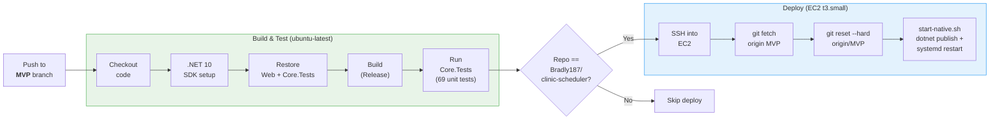

# CI/CD Pipeline — ClinicScheduler

> Paste into [mermaid.live](https://mermaid.live) to export as PNG/SVG for slides.

## What's Covered
- ✅ `ClinicScheduler.Web` — build
- ✅ `ClinicScheduler.Core.Tests` — 69 entity unit tests

## What's Not Covered in Pipeline
- ❌ `ClinicScheduler.Web.Tests` — 24 service unit + 53 integration tests (require Docker/Testcontainers)
- ❌ Branch protection / PR gating (deploys on any push to MVP)
