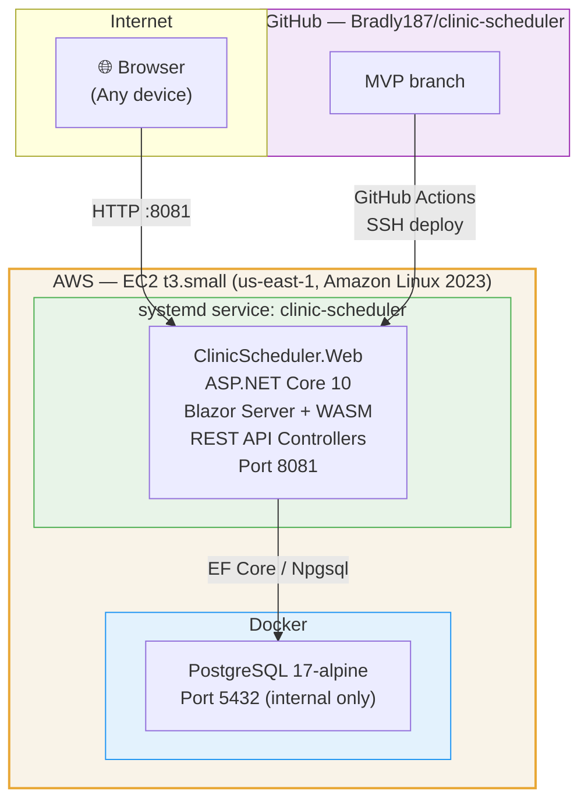

# Deployment Architecture — ClinicScheduler

> Paste into [mermaid.live](https://mermaid.live) to export as PNG/SVG for slides.

## Key Details
- .NET app runs **natively** under systemd (not in a Docker container)
- Only PostgreSQL runs in Docker
- Port 5432 is **not** exposed publicly — internal Docker network only
- HTTPS termination deferred (no load balancer / Nginx yet)
- Secrets loaded from `/home/ec2-user/clinic-scheduler/.env` (never committed)
