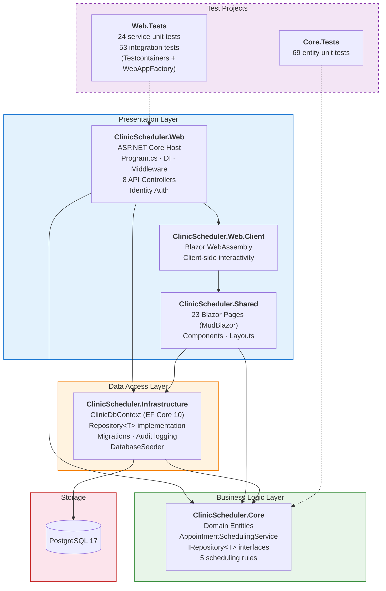

# System Architecture — ClinicScheduler

> Paste into [mermaid.live](https://mermaid.live) to export as PNG/SVG for slides.

## Dependency Direction
All arrows point **inward** — Presentation → Business → Data. Core has **zero** external project dependencies (only `System.ComponentModel.Annotations`), which keeps domain logic portable and testable.

## Key Design Decisions
| Decision | Rationale |
|---|---|
| Business rules in `Core`, not controllers | Controllers stay thin; rules are testable without HTTP |
| `IRepository<T>` in Core, implementation in Infrastructure | Dependency inversion — Core defines contracts, Infrastructure fulfills them |
| Shared project for Blazor pages | Same UI runs in Server and WebAssembly render modes |
| Testcontainers for integration tests | Real PostgreSQL, no mocks — catches SQL/EF issues that unit tests miss |
